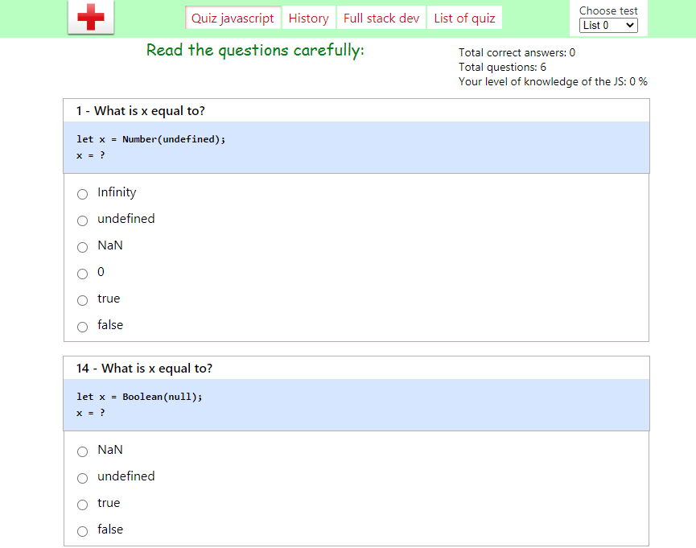

<h1 align="center">Javascript Quiz</h1>

## What is Javascript Quiz Designed For?

### Javascript Quiz is designed for:
Pass a knowledge test on javascript
Solving simple tasks

### Repeat the basics of the subject
DOM manipulations, Methods, Events, Types, Array, Object, Math, etc

## Play More
Try to play more in the [Js Quiz](https://snikos.github.io/js-quiz/)

